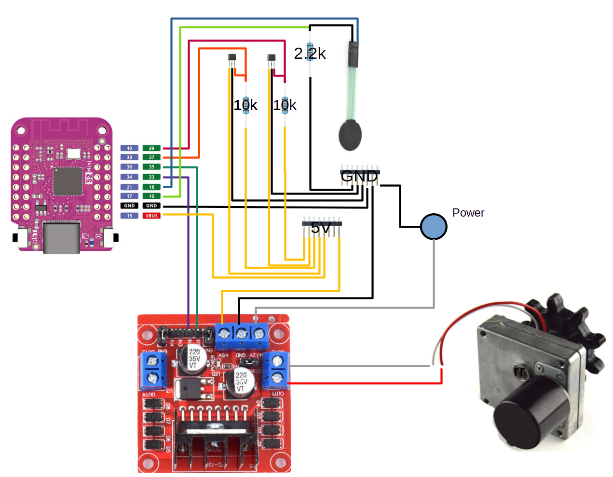
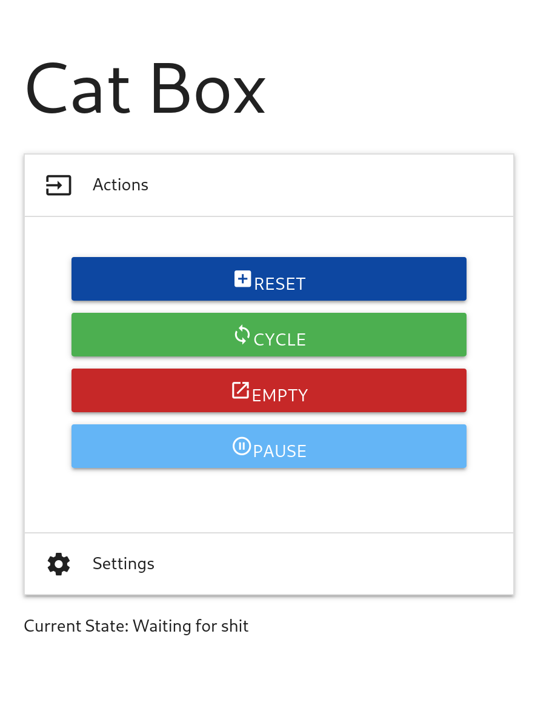
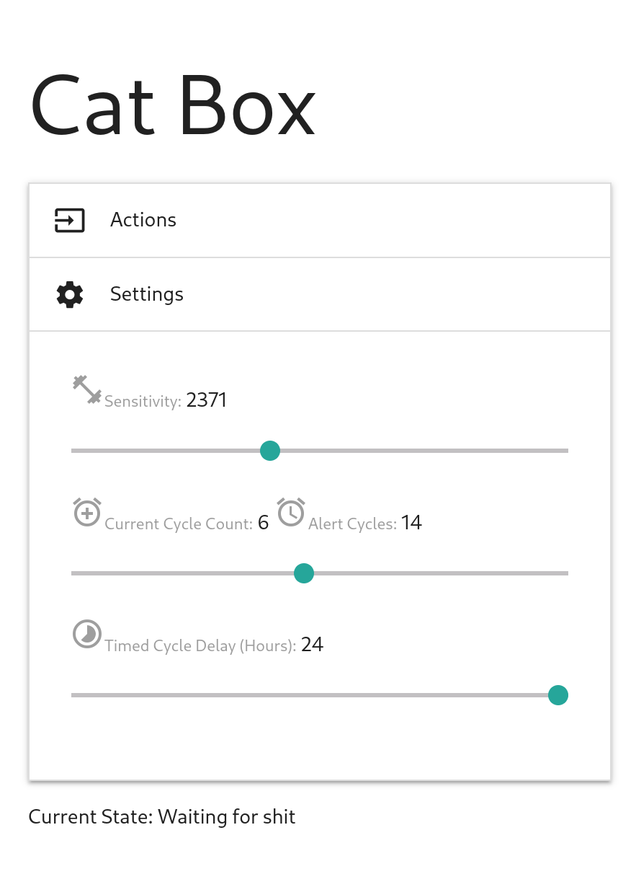

# Litter Box
 
This is code for an alternate main board for a litter robot 3.

## Features

### Current Working Features

* Clean litter box on cat detection (if CAT sensor is used).
* Clean litter box a set duration after last cycle. This is useful for cats too lite to trigger the box. It is also useful if the CAT sensor is not used.
* Empty litter box.
* Send email (or text message) on after a set number of cycles. 
* Web based UI.

### Litter Robot 3 Features not implemented

* Physical buttons
* Pinch detection
* Bin full detection

## Hardware Needed

* ESP32s2 mini
* L298N motor controller (used to drive motor and provide 5V voltage step down)
* One 2.2K resistor for the CAT detector
* Two 10K resistors for the hall effect sensors
* A Litter Robot 3 with a bad main board.

## Prepare the esp32s2 mini.

### Find the connection for board
Run `ls /dev/tty*` with the board unplugged and again with it plugged in.
Find the path to the added device and set it to `DEVICE_CONNECTION`, example:
```shell
export DEVICE_CONNECTION=/dev/ttyACM1
```

### Download the firmware
```shell
curl -o micropython.bin https://micropython.org/resources/firmware/LOLIN_S2_MINI-20231005-v1.21.0.bin 
````

### Flash micropython onto the board
Make S2 boards into Device Firmware Upgrade (DFU) mode.
* Hold on Button 0 
* Press Button Reset 
* Release Button 0 When you hear the prompt tone on usb reconnection

```shell
esptool.py --chip esp32s2 --port $DEVICE_CONNECTION erase_flash
esptool.py --chip esp32s2 --port $DEVICE_CONNECTION write_flash -z 0x1000 micropython.bin
```

### Customize the software (optional)
#### Configure web connection
In the `src/wifi` directory copy `default_secrets.py` to `secrets.py` and enter values for your network connection.
If `base_url` is none the devices ip address will be used directly.

#### Configure alerts
Alerts require a web connection. In the `src/alert` directory copy `default_secrets.py` to `secrets.py` and enter values for 
your email.

### Upload the software
Load the contents of the src directory to the board.

## Wire it up



## Run it

It should start running one the code is uploaded. 

Logs can be read via 

```commandline
picocom $DEVICE_CONNECTION -b115200
```

Note: If it is rotating in the wrong direction you can set `rotate_direction_reversed` to `true`.

### The UI

If you set up a web connection, you can access the ui via a web browser. It should look something like:

with settings something like:


### The API

* PATCH `/settings` 
  * Nearly all the settings are settable by sending a json object to this endpoint with the setting name and value.  
